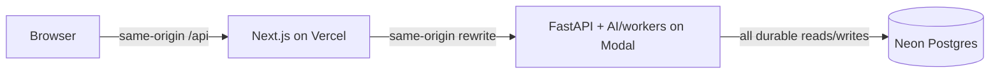

# Ambrosia Health dermatology operating system

Ambrosia is a synthetic-data demonstration of one operating system for dermatology: patient access, clinical documentation, longitudinal lesion tracking, pathology safety, patient communication, revenue cycle, AI-assisted work, and MSO analytics.

> **Synthetic data only.** This repository is not approved for real patient information, clinical care, live claims, prescriptions, laboratory exchange, messaging, or payments. See [data safety](docs/data-safety-security.md) and the [production gates](docs/production-readiness.md).

## Architecture



The browser never connects to Neon. Vercel contains presentation and same-origin routing; Modal owns authorization, domain rules, mutations, AI and durable-workflow execution; Neon is authoritative state. External payer, clearinghouse, remittance, messaging, eRx, pathology-transmission and settlement edges are explicit deterministic simulators in demo mode.

## Managed synthetic deployment

The hosted demo is live at [ambrosia-ehr.vercel.app](https://ambrosia-ehr.vercel.app). Vercel project `ambrosia-ehr` is linked natively to `ambrosia-health/ehr`, uses `apps/web` as its Root Directory, and creates branch/PR previews without a repository-managed Vercel token. The same-origin API targets Modal `staging` for previews and the workspace-visible Modal `main` environment for the production alias; both persist only synthetic data in isolated managed Neon branches.

Structured AI inference runs on a T4 with `Qwen/Qwen2.5-0.5B-Instruct` pinned to revision `7ae557604adf67be50417f59c2c2f167def9a775`. The internal endpoint requires a separate service secret, verifies prompt provenance, and accepts output only after capability-specific schema and semantic validation. Timeout, cold-start, malformed, unsupported, or unsafe output selects a visibly labeled deterministic fallback through the same proposal and human-approval path.

Normal product work needs no hosted credentials. Authorized platform operators can rerun [`scripts/provision-managed-infra.sh`](scripts/provision-managed-infra.sh) to reconcile Neon migrations/seed invariants, rotate and synchronize platform secrets, bind Vercel environments, deploy Modal `main` and `staging`, and fail closed unless API/database health, exact live-model provenance, output-schema validation, and the hosted seven-chapter Sarah journey pass. Resource IDs and operating details are recorded in [deployment and operations](docs/deployment.md).

## Local development

Prerequisites: Node.js 22–24 with npm, [uv](https://docs.astral.sh/uv), `curl`, and `make`. uv provisions the Python 3.12+ dependencies from the lockfile; npm runs the Next.js toolchain. Docker with Compose is optional for the Postgres-fidelity target.

```bash
make dev
```

`make dev` is the zero-credential one-command path: it creates the synthetic-safe `.env` when absent, installs dependencies, migrates a local SQLite database, idempotently seeds the canonical synthetic scenario, and runs FastAPI plus Next.js. Open [http://localhost:3000](http://localhost:3000). SQLite is a local convenience adapter; hosted state remains Neon Postgres. Use `make dev-postgres` for Docker Postgres 16 dialect fidelity; Ctrl-C stops application processes and `make db-down` stops that optional database.

Common workflows:

```bash
make reset       # guarded synthetic-only reset + canonical reseed
make verify-data # canonical counts, relationships, and financial invariants
make test        # deterministic backend and frontend tests
make e2e         # Playwright suite against a documented test-mode backend
make test-postgres # optional Docker Postgres migration/seed/backend tests
make check       # lint/type/build/test release checks
make demo-health # API, same-origin route, and canonical-scenario health
```

For the browser journey, reset once, keep `make dev` running, then run `make e2e` in a second terminal. The target supplies the presenter credential from `.env` and forces the live-stack Playwright spec to execute rather than silently skip.

Local defaults are safe only for disposable development. Generate unique session/presenter secrets before any shared preview. Hosted environments must use Neon TLS URLs and platform secret stores, never `.env`.

## Repository map

| Path | Responsibility |
|---|---|
| `apps/web` | Next.js patient, clinical, RCM, analytics and presenter UI; same-origin API rewrite |
| `backend` | FastAPI domain API, SQLAlchemy/Alembic, durable workflows, adapters, AI/fallback and Modal wrapper |
| `docs` | architecture, schema/FHIR mapping, safety, capability disclosure, deployment and readiness |
| `.github/workflows` | test/build gates, Vercel preview and Modal deployment |
| `DEMO.md` | presenter preflight and Sarah Mitchell journey |

## Demo and implementation truth

Start with [`DEMO.md`](DEMO.md). [`docs/capabilities.md`](docs/capabilities.md) distinguishes functional internal workflows, deterministic external simulators, AI fallback, and production gaps. UI polish or seed visibility alone is not evidence of persistence or authorization; the integrated tests and health checks are the acceptance evidence.

Key invariants:

- every tenant-owned record is organization-scoped and every Modal operation re-authorizes it;
- signed notes are immutable; corrections are append-only amendments;
- AI produces schema-validated proposals with provenance, not silent clinical/financial actions;
- durable jobs and demo timeline state live in Postgres, not a transient Modal queue;
- bundled demo images are explicitly synthetic public fixtures with owned metadata; any future user upload must use a private authorized object pipeline, never a Postgres blob;
- dashboard values are calculated from source records, not display constants.

## Documentation

- [Architecture and module ownership](docs/architecture.md)
- [Database/domain model](docs/database.md)
- [FHIR adapter mapping](docs/fhir-mapping.md)
- [Data safety and security](docs/data-safety-security.md)
- [Functional vs simulated capabilities](docs/capabilities.md)
- [Deployment and operations](docs/deployment.md)
- [Production-readiness backlog](docs/production-readiness.md)

## Delivery commands

Vercel's native Git integration creates previews for branches/PRs and deploys `main` to the production alias. The repository workflow verifies pull-request code and smoke-tests successful preview deployments; it does not create duplicate CLI previews or require `VERCEL_TOKEN`. Modal deploys use the tested application module:

```bash
make modal-serve
MODAL_ENVIRONMENT=main make modal-deploy
MODAL_ENVIRONMENT=staging make modal-deploy
```

Normal contributors use `make dev` and Git; they do not copy Neon URLs or manage Vercel/Modal secrets. Infrastructure maintainers use the guarded reconciliation script above when platform configuration or credentials must be refreshed. The hosted `production` label still denotes a **synthetic demo delivery tier**, not approval for real patient data or clinical production.
