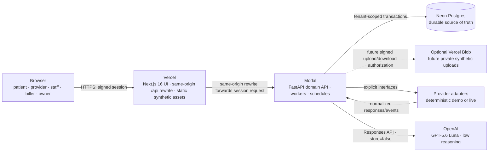
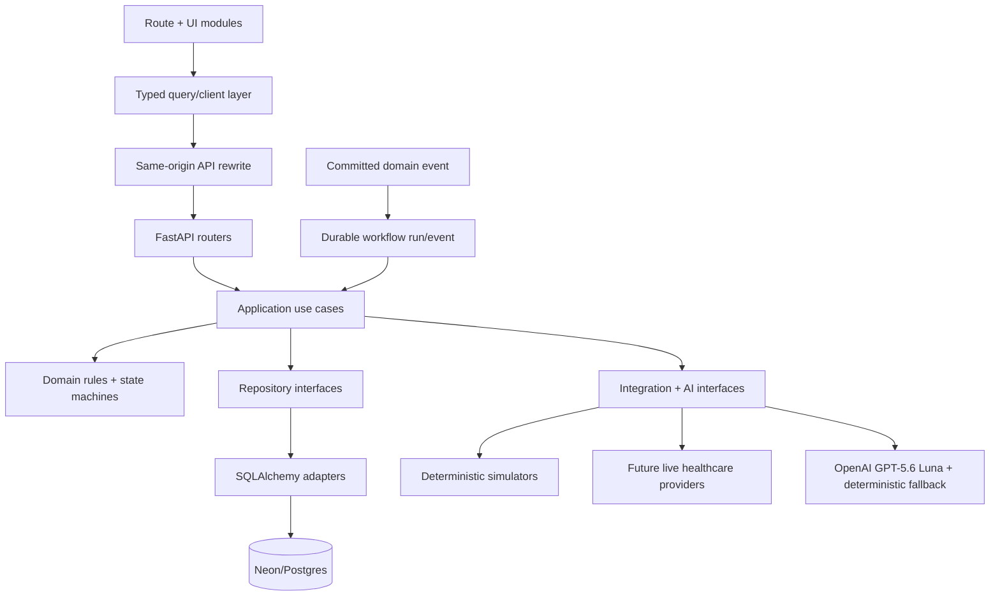
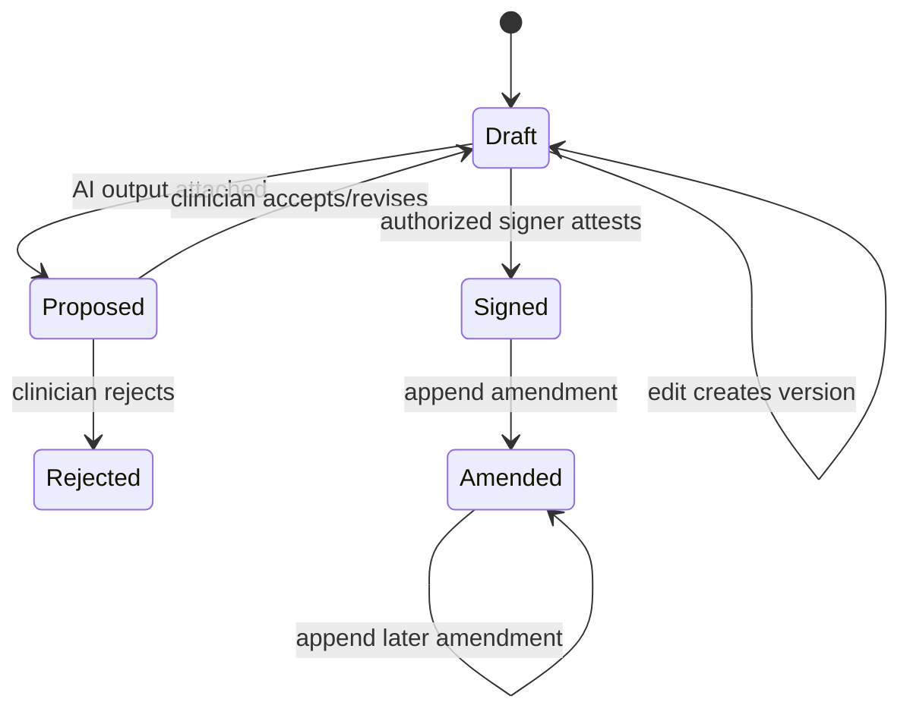
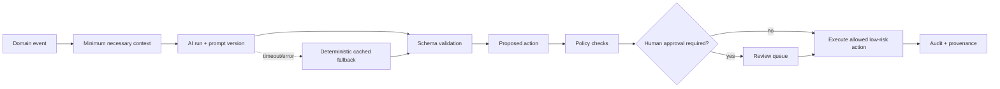

# Architecture and module ownership

This document is the architectural contract for the Ambrosia synthetic dermatology demo. Code and Alembic migrations are the implementation authorities; discrepancies are defects, not alternate architecture.

## Runtime topology



Non-negotiable boundaries:

- The browser never receives a database credential and never connects to Neon.
- Vercel owns presentation, routing, deployment, static delivery, and the `/api` rewrite. It contains no clinical or financial mutation logic.
- Modal authenticates and authorizes every read and write, owns transactions, runs AI and background work, and treats Neon as the durable queue/workflow store.
- Patient-specific responses are `private, no-store`; they are never placed in a shared Vercel cache.
- Large images stay out of Postgres. The demo's canonical licensed/generated synthetic assets are public frontend fixtures linked to owned `file_records`. Any future user upload must use a private object store with short-lived authorization; that upload/read pipeline is not implemented by the bundled demo.
- A Modal URL remains hostile/public even when normally reached through Vercel. Modal must validate the signed user session and tenant membership itself.
- `/api/demo/bootstrap` is an authenticated, server-side role-scoped read model—not an authorization shortcut. It may return only the patient, clinical, RCM, analytics, and presenter fields authorized for the verified session; the browser's persona state cannot broaden it.

The zero-credential local default runs the same FastAPI application under Uvicorn with SQLite; Docker Postgres 16 is the optional dialect-fidelity target. The managed hosted demo uses native Vercel Git previews, Modal `staging`/`main`, and isolated synthetic Neon `staging`/`main` branches; a separate Neon `preview` branch supports isolated migration verification. Changing the persistence/runtime adapter must not change domain behavior. Hosted environment names do not imply authorization for real PHI or clinical production.

## Dependency graph



Dependency direction is inward: adapters may depend on interfaces and domain types; domain code must not import Vercel, Modal, Neon, payer, lab, or model-provider SDKs. Cross-domain changes go through an application use case and one database transaction or an idempotent durable workflow—not UI choreography.

## Module ownership

Ownership means the module is the sole writer of its rules and tables. Other modules may read through documented queries or request changes through use cases/events. Exact subdirectory names may evolve; the boundary must not.

| Module | Primary code surface | Owns | May depend on |
|---|---|---|---|
| Web shell and design system | `apps/web/src/app`, `apps/web/src/components` | navigation, visual language, loading/empty/error states, accessibility | typed client and read models |
| Patient experience | web patient routes; backend engagement/scheduling use cases | initiation, intake, booking, consents, patient messages | identity, clinical facts, eligibility adapter |
| Command center | web operations routes; backend operations queries | readiness, work queues, alerts, staff tasks | scheduling, clinical, pathology, RCM read models |
| Clinical encounter | encounter workspace; clinical use cases | encounter state, transcript linkage, note lifecycle, assessment/plan | patients, lesions, orders, AI proposals |
| Lesions and media | body map/timeline; lesion/media use cases | persistent lesion identity, observations, comparisons, image metadata | clinical encounters, file adapter |
| Pathology | pathology workspace and use cases | order/specimen/result chain, review, notification, closure | procedures, lesions, messaging, tasks |
| Revenue cycle | RCM workspace and use cases | eligibility, estimates, claims, events, denials, appeals, payments, balances | encounters, coding proposals, provider adapters |
| MSO analytics | analytics routes and query services | metric definitions and aggregate queries | committed operational, clinical, and RCM facts |
| AI orchestration | backend AI application/adapters | prompts, schemas, runs, provenance, fallback, proposed actions | minimum-necessary read APIs; never direct record mutation |
| Identity and authorization | backend auth/policy | sessions, personas, memberships, role and tenant policy | organization data only |
| Workflow engine | backend workflow/worker | durable jobs, events, retry/idempotency policy, scheduled jobs | application use cases and Neon |
| Provider adapters | backend integrations | eligibility, clearinghouse, remittance, SMS, eRx, pathology, payments | stable integration interfaces |
| Persistence | SQLAlchemy + Alembic | transaction boundaries, constraints, indexes, repository implementations | domain/application contracts |
| Demo control plane | protected presenter UI + backend demo use cases | canonical reset, simulated clock, trigger idempotency, health | every module through explicit demo APIs |
| Delivery and operations | root, `.github`, `docs` | local workflows, CI/CD, environment contract, runbooks | build/test/deploy entrypoints |

Path-level ownership rules:

- `apps/web/**` never imports backend packages or database clients.
- `backend/**` never imports frontend artifacts.
- `docs/**` explains contracts; it does not replace executable constraints or tests.
- Schema changes require an Alembic migration, an updated database document, and compatibility consideration for deployed frontend/backend versions.
- Shared status labels have one canonical enum/translation per domain. The UI must not invent alternate state transitions.

## Cross-domain state transitions

### Signed clinical record



Signing freezes the exact note version, signer, timestamp, and provenance references. A signed body is never overwritten. Corrections are append-only amendments referencing the prior signed record. AI can create a proposal but cannot sign, amend, place an order, send a clinical message, submit a claim, or update a result without the applicable policy/approval.

### Biopsy completion transaction

```mermaid
sequenceDiagram
    participant C as Clinician
    participant API as Modal use case
    participant DB as Neon transaction
    participant W as Durable workflows

    C->>API: Approve review-and-complete bundle + idempotency key
    API->>API: Re-authorize, validate proposal versions and consent
    API->>DB: Sign note; create procedure, specimen, order, claim, tasks, messages, audit/provenance
    DB-->>API: Commit one coherent record graph
    API->>W: Enqueue post-commit delivery/provider work
    API-->>C: Completed resource IDs and statuses
```

If the transaction fails, none of the clinical graph is partially committed. Retrying the same idempotency key returns the original result. External delivery happens after commit and records each attempt; a provider outage cannot erase the internal order or task.

### Claims and pathology

Allowed claim path: `draft → validated → submitted → accepted → adjudicated → paid`. A rejection returns to a correctable pre-adjudication state; a denial creates a denial/workflow record and can proceed through appeal/resubmission without deleting history.

Allowed pathology path: `ordered → specimen_collected → sent → received → clinician_reviewed → patient_notified → closed`. Every open result has an accountable task, due time, and escalation. Demo time advancement evaluates the same durable rules as a scheduled worker.

## Request contract

Every mutating request carries:

- a signed session identifying user and active organization;
- server-derived role/membership—not a trusted client-supplied role;
- a request/correlation ID;
- an idempotency key for retryable commands;
- an optimistic version where concurrent edits are possible;
- an explicit reason when policy requires one (amendment, override, result acknowledgement).

Every response containing patient or financial data sets private/no-store caching. Errors expose a stable code and correlation ID, not a stack trace, SQL, secret, prompt, or clinical content.

## AI execution contract



An `ai_run` captures capability, input references/checksums, prompt version, model/fallback identity, structured output, latency, and status. It should not duplicate unrestricted chart content. Output is untrusted until schema and rule validation. UI labels distinguish AI-proposed, human-edited, approved, signed, and fallback-generated content.

The managed domain API calls OpenAI `gpt-5.6-luna` directly through the Responses API with `reasoning.effort=low` and `store=false`. There is no local model runtime, GPU allocation, or separate inference endpoint. Exact provider/model/reasoning configuration, prompt hashing, schema validation, and capability-specific semantic rules are required before the backend may record a live run; every failure routes to a deterministic, provenance-labeled proposal rather than gaining broader authority.

## Tenancy and time

- Every tenant-owned row includes `organization_id`; child foreign keys cannot be used to escape that scope.
- Repository APIs require a tenant context. Global unscoped list/get helpers are forbidden outside audited platform administration.
- Timestamps are stored as timezone-aware UTC. The organization/location timezone is applied only for presentation and schedule interpretation.
- Demo time is an organization/scenario clock, never a mutation of host time. Events are keyed by scenario, trigger, and logical time so advancing twice is safe.

## Architectural decision records

| Decision | Reason | Consequence |
|---|---|---|
| Domain-first schema, not internal FHIR | Clinical/operational workflows need product-native aggregates | FHIR is an adapter contract; mappings are documented separately |
| Neon is the workflow source of truth | Queues must survive worker restarts and support audit/replay | Modal Queue cannot hold authoritative workflow state |
| Same-origin API from browser | Simplifies cookies, CSP, and CORS while hiding backend topology | Next and Modal must preserve the session request and private/no-store response headers; add a route-handler proxy if future header/body filtering is required |
| Proposals before AI actions | Model output is probabilistic and clinical/financial changes are consequential | Structured approval and provenance are first-class records |
| Deterministic provider/model fallbacks | A demo cannot depend on network timing or cold inference | Fallback identity must be visible and behaviorally equivalent at the domain boundary |
| Append-only signed records and event history | Medical/legal integrity requires reconstruction | Corrections and state changes add records rather than rewrite history |
