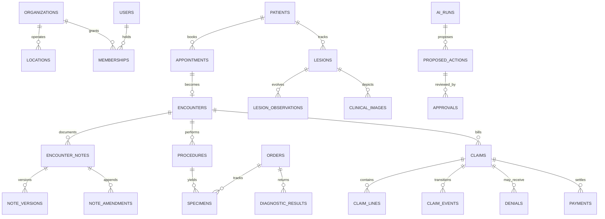

# Database and domain model

Neon Postgres is the durable source of truth in hosted environments. This is the logical data contract; `backend/alembic/versions/**` is authoritative for the schema actually deployed. Until a table appears in a migration and a repository/test exercises it, its presence here is a requirement, not an implementation claim.

## Modeling rules

1. Tenant-owned tables carry a non-null `organization_id`, indexed with their common lookup keys. Globally unique IDs do not replace tenant filters.
2. IDs are UUIDs/ULIDs generated before insert where useful for idempotency. External identifiers retain system, value, issuer, and validity instead of replacing internal IDs.
3. Mutable rows carry `created_at`, `updated_at`, and an optimistic version. Events, signatures, provenance, and audit rows are append-only.
4. UTC `timestamptz` is mandatory for instants. Local date/time fields additionally retain location timezone where scheduling semantics require it.
5. Enumerated workflow states use constrained values. State history lives in event tables; current state on the aggregate is a projection for efficient reads.
6. JSONB is appropriate for bounded external payload snapshots, validated AI structures, and evolving metadata—not for normalized intake, medications, allergies, claims, tasks, or relationships.
7. Clinical images and documents are objects, not byte columns. Postgres stores a `file_record` with tenant/patient ownership, provider key, MIME type, byte size, checksum, classification, and lifecycle state.
8. Demo reset is scoped to the canonical demo organization/scenario and transactionally guarded. In production it additionally requires `ALLOW_SYNTHETIC_DEMO_RESET=true`; a generic environment flag is never sufficient authorization by itself.

## Aggregate graph

The graph is intentionally selective; foreign keys in migrations must preserve the full patient → lesion → image → encounter → procedure → specimen → order → result chain shown during Sarah Mitchell’s journey.

## Table catalog

### Identity and organizations

| Table | Purpose and important relationships |
|---|---|
| `organizations` | Tenant root; synthetic/live classification, display name, timezone, status. |
| `locations` | Organization clinic/site with address and timezone; appointments and encounters reference it. |
| `users` | Authentication subject and lifecycle only; sensitive identity fields are minimal. |
| `memberships` | User ↔ organization assignment, active state, persona defaults; uniqueness prevents duplicate active membership. |
| `roles` | Stable role/policy identifiers. Authorization remains server policy, not user-editable labels. |
| `providers` | Clinician attributes, credentials and explicitly non-production synthetic taxonomy/NPI values; links to a user/membership. |
| `staff_profiles` | Non-provider staff details and operational assignment. |
| `patient_accounts` | Portal identity ↔ patient relationship, invitation/activation state, communication verification. |

### Clinical

| Table | Purpose and important relationships |
|---|---|
| `patients` | Demographics, MRN, status, preferred language/timezone; tenant-unique MRN. |
| `patient_contacts` | Normalized phone/email/address/emergency contacts with use, rank, verification, and validity. |
| `coverages` | Payer/member/group/relationship and effective dates; eligibility responses reference coverage. |
| `allergies` | Coded substance, reaction, severity, verification and lifecycle; never only intake JSON. |
| `medications` | Coded/name medication, dose/route/frequency, status, source and dates. |
| `problems` | Coded condition/problem list with onset, status, verification and recorder. |
| `appointments` | Patient, location, provider, reason, start/end, status, booking source, readiness. |
| `encounters` | Visit aggregate linked to appointment/patient/provider; status and actual times. |
| `encounter_notes` | Note identity, encounter, type, current draft/signed version references and lifecycle. |
| `note_versions` | Immutable content snapshot, author, source, timestamp, hash, parent version; signing targets one exact version. |
| `note_amendments` | Append-only correction/addendum to a signed note with author, reason, signature and timestamp. |
| `lesions` | Persistent patient lesion, stable label and canonical body site; not recreated per encounter. |
| `lesion_observations` | Time-series dimensions, morphology, border, pigment, change, symptoms, observer and encounter. |
| `clinical_images` | Clinical association and capture metadata; references `file_records`, lesion, patient, encounter, consent. |
| `procedures` | Performed procedure, status, performer, site, technique, times, and encounter/lesion links. |
| `consents` | Consent type/version, subject, scope, attestation, status and signed/revoked times. |
| `orders` | Service/pathology order with requester, subject, specimen, status, priority and timestamps. |
| `specimens` | Accessionable specimen, source/site, collection/container and custody state; links procedure and order. |
| `diagnostic_results` | Structured result, conclusion, abnormality, received/reviewed status; links order, specimen, lesion and patient. |

### Patient engagement

| Table | Purpose and important relationships |
|---|---|
| `conversations` | Patient/care-team thread, topic, channel, participants and triage state. |
| `messages` | Immutable sent/received message, author, body/content reference, delivery status and timestamps. |
| `message_drafts` | Editable AI/human draft with grounding source references and review state; sending creates a message. |
| `questionnaires` | Versioned form definition and intended workflow. |
| `questionnaire_responses` | Response header; normalized clinical answers create/update allergies, medications, problems, contacts, coverage, etc. |
| `communication_preferences` | Patient channel, language, consent/opt-out, quiet hours and verified endpoints. |
| `appointment_reminders` | Reminder schedule, provider attempt, outcome and appointment link. |

### Operations

| Table | Purpose and important relationships |
|---|---|
| `tasks` | Accountable work item with subject/resource, owner/queue, priority, status, due/escalation times. |
| `task_comments` | Append-only human collaboration on a task. |
| `workflow_runs` | Durable workflow instance, type, aggregate key, status, next attempt, retry count, idempotency key. |
| `workflow_events` | Append-only transitions/attempts for replay, diagnostics, and audit. |
| `automation_policies` | Versioned tenant rules for reminders, escalation, approvals and simulated adapters. |
| `notifications` | In-product notification with recipient, resource, read/dismissed state; not a replacement for messages. |

### Revenue cycle

| Table | Purpose and important relationships |
|---|---|
| `eligibility_checks` | Coverage request/result, effective benefits, source adapter, status and raw payload reference. |
| `estimates` | Versioned service estimate with expected allowed, plan, patient amounts and assumptions. |
| `claims` | Encounter claim aggregate, payer/coverage, totals, current lifecycle, submission identity. |
| `claim_lines` | Procedure/diagnosis-linked service line, units, charge, allowed/paid/adjustment amounts. |
| `claim_events` | Append-only validation, submission, response and state transitions with source and occurred time. |
| `claim_responses` | Structured acknowledgement/adjudication/remittance payload mapped to claim/lines. |
| `denials` | Denial reason/category, amount at risk, ownership, root-cause and resolution state. |
| `appeals` | Versioned appeal package, rationale, evidence references, status and transmission history. |
| `payments` | Payer/patient payment allocation with external reference and settlement status. |
| `patient_balances` | Patient-account ledger/projection by charge, adjustment, payment and remaining balance. |

All money uses fixed-precision decimal or integer minor units plus ISO currency. Header totals are constrained to equal line allocations through application validation and reconciliation tests; dashboard revenue never comes from display constants.

### AI and safety

| Table | Purpose and important relationships |
|---|---|
| `ai_runs` | One capability execution with status, model/fallback, prompt version, timing and token/cost metadata. |
| `ai_inputs` | Minimum-necessary resource references, versions and checksums; avoid duplicating raw chart text. |
| `ai_outputs` | Schema-versioned structured output and validation outcome. |
| `proposed_actions` | Typed, reviewable command with target/version, risk, rationale and lifecycle. |
| `approvals` | Reviewer decision, role, timestamp, edits/reason; an approval applies to one proposal version. |
| `provenance_records` | Derivation chain among input resources, AI/human agents, output and executed domain records. |
| `prompt_versions` | Immutable capability prompt/schema/evaluation identity and release status. |

### Governance and demo

| Table | Purpose and important relationships |
|---|---|
| `audit_events` | Append-only actor, tenant, action, target, outcome, request ID, time and bounded change metadata. |
| `file_records` | Private object metadata, ownership/classification, checksum, provider locator and deletion lifecycle. |
| `integration_events` | Provider request/response state, deduplication key, attempt and normalized resource links. |
| `demo_scenarios` | Canonical synthetic scenario identity, seed version, logical clock and reset state. |
| `demo_timeline_events` | Triggerable events with logical due time, payload version, status and unique execution key. |

## Integrity constraints

- Child records reference the same organization as their aggregate root. Enforce with composite keys where practical and verify in repository tests everywhere else.
- One active encounter per appointment; one canonical signed version per note; signatures cannot target a mutable body.
- A note version hash covers canonical content and identity. Amendments never update or delete that version.
- A result’s patient/specimen/order/procedure/lesion chain must agree; receiving a mismatched accession fails closed and creates reconciliation work.
- A claim line references the performed procedure/encounter it bills. Submitted claim history is never rewritten; corrections create events/replacements.
- Provider webhooks and demo triggers use unique `(organization_id, provider, external_event_id)` or equivalent keys.
- AI approval requires the proposal’s current version and target’s expected version, preventing stale approval from overwriting newer work.
- Hard deletes are limited to synthetic reset or legally governed purge jobs. Ordinary workflows close/cancel/void records and preserve history.

## Index strategy

Every tenant query begins with `organization_id`. High-value compound indexes include:

- schedule: `(organization_id, location_id, starts_at, status)` and `(organization_id, provider_id, starts_at)`;
- patient search: tenant MRN uniqueness plus carefully normalized name/DOB indexes;
- queues: `(organization_id, status, priority, due_at)` for tasks, workflows, results and denials;
- lesion timeline: `(organization_id, lesion_id, observed_at desc)`;
- messages: `(organization_id, conversation_id, sent_at)`;
- claim work: `(organization_id, status, updated_at)` and denial owner/due time;
- audit: `(organization_id, target_type, target_id, occurred_at)` and `(organization_id, actor_id, occurred_at)`;
- idempotency: unique tenant-scoped keys on commands, integrations, workflow triggers and payments.

Indexes must be justified with production-like query plans before a pilot; avoid indexing sensitive free text.

## Analytics definitions

MSO metrics are SQL/read-model calculations over committed records. Each metric must publish its timezone, window, filters, numerator/denominator, and last-refreshed time.

| Metric | Canonical derivation |
|---|---|
| Appointment conversion | booked appointments / qualified initiation conversations in the window |
| No-show rate | appointments with `no_show` / appointments that reached a terminal attended/no-show state |
| Patient response time | median duration from inbound patient message to first qualifying staff/provider response |
| Time to signed note | median `signed_at - encounter.ended_at` for signed encounters |
| Open pathology | results/orders requiring review, notification, or closure at the as-of time |
| Pathology closure time | median `closed_at - result.received_at` |
| Claim acceptance | claims accepted by clearinghouse / first submissions excluding test/void claims |
| Denial rate | adjudicated claims with denial / adjudicated claims; also report amount-weighted rate |
| Days in A/R | sum(open balance × age days) / total open balance, with zero-balance guard |
| Revenue per visit | allocated settled payments / eligible completed encounters |
| Documentation time | measured active documentation seconds or signed-minus-start proxy, labeled by method |
| Staff work avoided | completed automation events × versioned conservative time assumptions; never presented as observed labor |
| Satisfaction | response distribution and response rate, never an unlabeled invented composite |

`staff work avoided` is an estimate and must expose its assumptions. Demo numbers come from seeded underlying events and timestamps, not hard-coded KPI values.

## Migration and seed discipline

- Alembic revision `20260716_0001` is the shared baseline and is frozen. `.github/frozen-migrations.sha256` is checked by CI/deployment; never regenerate, edit, or merely update its checksum after this handoff. Every schema correction uses a new revision. All later revisions are likewise immutable after sharing and follow expand/migrate/contract changes compatible with concurrently deployed application versions.
- CI upgrades an empty database to head and, when fixtures exist, exercises upgrade from the prior release baseline.
- Seed uses stable natural scenario keys plus upserts so rerunning it is idempotent. It records a seed version and checks referential/financial invariants.
- Reset targets only the canonical demo organization, fails if it is absent, and in `production` additionally requires `ALLOW_SYNTHETIC_DEMO_RESET=true`; presenter/API reset also requires an active delegated presenter session.
- Production migrations use a direct/non-transaction-pooling Neon connection where required by the migration operation; application traffic uses the pooled URL.
