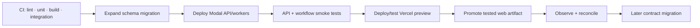

# Development, preview, and deployment

This runbook preserves the three-platform boundary: Vercel hosts Next.js, Modal hosts FastAPI/AI/workers, and Neon stores durable state. The managed deployment below is live and reproducible, but it is **synthetic demo infrastructure only**. A Vercel `Production` label, reachable Modal function, or Neon production branch does not authorize real PHI, clinical care, live networks, or patient-facing AI.

## Environment matrix

| Environment | Web | API/workers | Database | Data/network policy |
|---|---|---|---|---|
| Local | Next.js dev on `:3000` | same FastAPI app under Uvicorn on `:8000` | SQLite zero-credential default; optional Docker Postgres 16 | canonical synthetic seed; deterministic provider adapters; local AI fallback |
| Preview | native Vercel branch/PR Preview | managed Modal `staging` API | managed synthetic Neon `staging`; `preview` branch reserved for isolated migration/verification work | deterministic networks; authenticated pinned open-weights AI with deterministic fallback |
| Staging | Vercel preview surface | managed Modal `staging` | isolated synthetic Neon `staging` branch | production-like demo configuration; no live provider credentials/data |
| Production | Vercel Production alias | managed Modal `production` | isolated synthetic Neon `main` branch | publicly hosted synthetic demo; every real-world P0 gate remains open until separately evidenced |

Never point a preview at the hosted-production Neon branch or any live provider credential. Keep synthetic branches, session keys, and Modal Secrets environment-bound; real-data use requires the stronger account/project/database/role isolation selected by the production threat model. `NEXT_PUBLIC_*` values are visible to anyone; only the public app URL belongs there.

## Managed resource registry

Identifiers and URLs below are operational metadata, not credentials. Connection strings, session keys, presenter codes, Modal internal-auth secrets, and CLI tokens remain only in platform secret stores.

| Platform | Managed resource | Binding |
|---|---|---|
| Vercel | project `ambrosia-ehr`, ID `prj_ad1AsXV5muySOAyBsxMgcKAj1SVa` | repository `ambrosia-health/ehr`; Root Directory `apps/web`; production branch `main`; canonical site [ambrosia-ehr.vercel.app](https://ambrosia-ehr.vercel.app); native Git previews enabled |
| Neon | project `ambrosia-ehr`, ID `round-cloud-23718842`; database `ambrosia` | `main` / `br-still-wildflower-aunolqvx` (hosted production demo), `staging` / `br-rough-feather-auv415ro`, `preview` / `br-lingering-queen-au7d3n4t` |
| Modal staging | environment `staging`, app `ambrosia-health-domain-api` | API `https://kshr-ai-staging--ambrosia-health-domain-api-api.modal.run`; authenticated inference `https://kshr-ai-staging--structured-inference.modal.run` |
| Modal production | environment `production`, app `ambrosia-health-domain-api` | API `https://kshr-ai-production--ambrosia-health-domain-api-api.modal.run`; authenticated inference `https://kshr-ai-production--structured-inference.modal.run` |

The inference URLs reject requests without the matching environment-specific `X-Ambrosia-Internal` secret. They must never be called directly from browser code or treated as anonymous model APIs.

## Local workflow

```bash
make dev
```

The command creates `.env` from the synthetic-safe template when absent, installs `backend[dev]` into `.venv`, installs the web lockfile, creates a disposable local SQLite database, migrates, idempotently seeds, then runs both processes. No Neon, Modal, Vercel, GitHub, Docker, or cloud credential is required. Validate from another terminal:

```bash
make demo-health
make test
```

Run the same application against Postgres 16 when Docker is available:

```bash
make dev-postgres
make test-postgres
```

SQLite makes the demo runnable without credentials or hosted dependencies; it is not the hosted architecture. CI also migrates/seeds/tests a localhost Postgres 16 service, and deployed environments use Neon Postgres. Pytest defaults to an isolated temporary SQLite database; it may honor an explicit database URL only for `APP_ENV=test`, a local host, and `ALLOW_TEST_DATABASE_RESET=true`. That guard must never be enabled for a Neon or production URL.

The CI matrix independently runs backend SQLite tests, a Postgres 16 migration/seed/invariant suite, web lint/type/test/build, and an integrated Playwright journey. The browser journey keeps `NEXT_PUBLIC_DEMO_TEST_MODE=false` and exercises real signed login/persona-switch cookies. `X-Demo-Persona` is reserved for isolated API tests and is accepted only when backend `APP_ENV=test` is explicit; it must never authenticate the integrated browser journey.

For a local browser run, start from the canonical state with `make reset`, keep `make dev` running, and invoke `make e2e` in a second terminal. The Make target reads the presenter code from `.env`, opts into the live-stack spec, and leaves the persona header disabled. The CI job additionally parses Playwright's JSON report and fails an all-skipped run.

Reset only the configured synthetic scenario:

```bash
make reset
```

`reset` must refuse when the backend environment is not explicitly synthetic. `docker compose down -v` is intentionally not a product reset: it destroys the optional entire local Postgres volume and bypasses scenario safeguards.

## Configuration contract

### Vercel server environment

| Variable | Scope | Purpose |
|---|---|---|
| `AMBROSIA_API_ORIGIN` | Preview/Production server only | Base URL of the corresponding Modal ASGI function; used by the same-origin `/api` rewrite. |
| `NEXT_PUBLIC_APP_URL` | public | Canonical web origin for links; contains no secret. |
| `NEXT_PUBLIC_DEMO_TEST_MODE` | public | Keep `false` for local, preview, production and integrated E2E. It may be `true` only in an isolated frontend/API harness whose backend is explicitly `APP_ENV=test`; that harness alone may send `X-Demo-Persona`. |
| `BLOB_READ_WRITE_TOKEN` | server only, if uploads enabled | Private synthetic upload adapter. Do not expose to the browser. |

Frontend requests remain `/api/...`. Next.js performs a same-origin rewrite to Modal, preserving the browser's session request. Modal authenticates and authorizes it, assigns or returns `X-Request-ID`, and emits private/no-store headers; Next adds matching no-store and `Vary: Cookie` headers. This demo does not implement a custom route-handler proxy or a header/body allowlist. Explicit forwarding rules and body/time limits are production gates if the rewrite is replaced by a proxy.

### Modal runtime secret

Create a Modal Secret named `ambrosia-runtime` in each Modal environment containing at minimum `DATABASE_URL`, `AUTH_SESSION_SECRET`, `MODAL_INTERNAL_AUTH_SECRET`, `DEMO_PRESENTER_SECRET` (synthetic demo environments only, including the current hosted Production alias), `APP_ENV`, `EXECUTION_PLATFORM=modal`, `DEMO_MODE`, `SESSION_COOKIE_SECURE`, `AUTO_CREATE_SCHEMA=false`, `AUTO_SEED=false`, `CORS_ORIGINS`, AI/provider credentials and adapter selections. Hosted Neon URLs require TLS. Keep a separate direct/migration URL in protected CI rather than application containers where feasible. Session signing and service-to-service inference authentication use distinct high-entropy values.

The demo Modal wrapper must declare the intended secret name and ASGI app; merely setting local shell variables does not inject them into a deployed container.

The current `backend.modal_app` contract is deliberately small:

- `modal.App("ambrosia-health-domain-api")` builds a Python 3.12 image from the locked backend project and mounts the `app` package;
- `api` exposes the FastAPI application through `@modal.asgi_app()`;
- `structured_inference` is an internal callable, while `structured_inference_webhook` is the HTTP boundary configured by `MODAL_AI_URL`; the HTTP boundary rejects a missing/wrong `X-Ambrosia-Internal` value, validates a named capability and response schema, and must use `MODAL_INTERNAL_AUTH_SECRET`, never the user-session signing secret;
- `StructuredClinicalModel` runs `Qwen/Qwen2.5-0.5B-Instruct` on a T4, with model weights pinned to immutable revision `7ae557604adf67be50417f59c2c2f167def9a775`; generation is deterministic (`do_sample=false`) but remains probabilistic software, not a clinical authority;
- the HTTP boundary verifies the versioned prompt hash, parses output into the capability schema, applies semantic constraints (including allowed-code, urgency, grounding, and uncertainty-routing checks), and labels a run live only when exact provider/model/prompt attestation is present;
- cold start, timeout, resource pressure, malformed JSON, schema failure, semantic failure, missing provenance, or revision mismatch selects the deterministic `ambrosia-fixture-2026.1` fallback. Live and fallback outputs remain proposals subject to the same human gate;
- `durable_workflow_poller` wakes every five minutes, reads due scheduled reminders and overdue tasks from Postgres, invokes the messaging simulator, and escalates task priority. Postgres remains authoritative. This is not yet a general lease/retry/dead-letter worker engine; that is a pilot gate.

`backend/uv.lock` is the Modal SDK/CLI authority and currently resolves Modal 1.5.2. CI installs it with `uv sync --locked`; update `pyproject.toml` and the lockfile together, then revalidate decorators and `modal deploy -m backend.modal_app` before merging an SDK upgrade.

### GitHub environments and secrets

| Secret/variable | Workflow |
|---|---|
| `MODAL_TOKEN_ID`, `MODAL_TOKEN_SECRET` | Modal CLI deployment identity |
| `NEON_DATABASE_URL_DIRECT` | protected migration job; environment-specific |
| `MODAL_API_HEALTH_URL` | post-deploy authenticated/non-sensitive health endpoint URL |
| `MODAL_AI_URL`, `MODAL_INTERNAL_AUTH_SECRET` | authenticated live-model attestation after deploy |
| `PRESENTER_ACCESS_CODE` | protected integrated demo/E2E access; synchronized separately into Vercel |

GitHub `staging` and `production` environments are provisioned and environment-specific. Enforce required reviewers before treating the latter as a controlled release boundary. Restrict deployment credentials to service identities, rotate them, and never echo credential-bearing URLs or environment files. Native Vercel Git deployment does **not** require `VERCEL_TOKEN` in GitHub.

## Managed reconciliation and attestation

Authorized platform operators use one desired-state reconciliation entrypoint:

```bash
./scripts/provision-managed-infra.sh
```

The script requires already authenticated `gh`, `neonctl`, Modal, and Vercel CLIs. It is safe to rerun against the registered resources: migrations, canonical seed loading, environment-variable replacement, secret creation, and deployments converge instead of accumulating resources. Each run intentionally generates new high-entropy presenter, session, and internal-auth secrets, so it is also a coordinated credential rotation.

The script:

1. resolves pooled and direct TLS URLs for the registered Neon branches without printing them;
2. migrates, idempotently seeds, and verifies staging and hosted-production demo databases;
3. replaces Modal runtime/internal secrets and matching GitHub environment secrets;
4. replaces Vercel Preview/Production API origins, presenter credential, public origin, and demo-test flag;
5. deploys both Modal environments and verifies API plus Neon readiness;
6. calls each authenticated inference URL with a versioned prompt and fails closed unless headers identify `modal_open_weights`, the exact pinned Qwen revision, `fallback=false`, the exact prompt hash, and a schema-valid body;
7. retains the freshly rotated presenter credential only in process memory while Playwright completes the seven-chapter journey against the Vercel production alias, including reset, persistence, pathology, messaging, denial recovery, MSO metrics, a final canonical reset, and logout.

`RUN_HOSTED_E2E=0` skips the final browser journey only for a deliberate infrastructure-only recovery operation; it is not a release attestation. Vercel masks sensitive values on environment pull, so the provisioner runs hosted E2E before discarding the generated presenter credential instead of copying that credential to disk. A passing hosted run leaves the canonical scenario at chapter one rather than leaving production in the completed test state.

This script is an infrastructure-maintainer operation, not contributor bootstrap. Product developers and new agents use `make dev` locally and Git for hosted previews; they do not handle connection strings or platform secrets.

## Vercel preview

The Vercel project is already linked to GitHub with Root Directory `apps/web`. A branch/PR push creates one native Vercel Preview; a `main` push creates a Production deployment. Preview server traffic rewrites to Modal staging, while the Production alias rewrites to Modal production.

`.github/workflows/vercel-preview.yml` has two responsibilities and no deployment credential:

1. on pull requests or manual dispatch, run `npm ci`, lint, typecheck, unit tests, and a production build;
2. on a successful non-production `deployment_status`, smoke the rendered root and `/api/health`, proving the Vercel-to-Modal-to-Neon path.

Require repository checks before merge and validate authentication/role policy, no-store headers, and the Sarah critical path on the exact preview. Vercel rollback re-points web traffic but cannot reverse Modal code or a Neon migration.

## Modal development and deployment

Official Modal CLI behavior: `modal serve` hot-reloads web functions and `modal deploy` creates/updates a persistent app. The managed `staging` and `production` environments already contain `ambrosia-runtime` and the narrower `ambrosia-ai-internal` secret. The current repository wrapper is addressed by `MODAL_APP_MODULE`.

```bash
# Authenticates the developer CLI once; do not use personal credentials in CI.
.venv/bin/modal setup

# Ephemeral development URL with hot reload.
MODAL_ENVIRONMENT=dev make modal-serve

# Tested persistent deployment.
MODAL_ENVIRONMENT=staging make modal-deploy
```

Direct one-off deployment is useful during development, but the reconciliation script is the authoritative way to rotate secrets, preserve API/inference pairings, update Vercel bindings, and attest both managed environments. Verify direct unauthenticated domain requests fail even though the health endpoint intentionally exposes only bounded readiness state.

The domain API keeps one warm container in each managed environment (`min_containers=1`, 20-minute idle window, maximum four) so the interactive demo does not begin with a cold API boot. GPU inference still scales to zero and retains its visible deterministic fallback; this bounds idle spend without weakening the clinician approval gate.

`.github/workflows/modal-deploy.yml` performs: frozen-migration checksum → install/check/test → Neon migration → tagged Modal deploy → API/database health → authenticated live-model warm-up and exact provenance/schema attestation. `main` deploys to staging; production is a manual dispatch through the `production` GitHub environment, which must have required reviewers before it is treated as a protected release boundary. CI uses the installed-CLI-compatible form `modal deploy -m <module> --env <environment> --tag <sha>`.

## Release ordering

For a compatible change:



- Migrations are backward compatible with both old and new Modal/API versions and any active browser session.
- A deploy never combines a destructive migration with code requiring it immediately. Backfill in durable, observable batches.
- Workers tolerate old/new event payload versions during the rollout.
- Health means database connectivity, migration compatibility and required adapters/seed state—not that downstream clinical results are safe to discard.

## Smoke gates

After each hosted deployment:

1. Modal `GET /api/health` reports process and database readiness without secrets or patient data.
2. Web `/api/health` proves the Vercel-to-Modal path, not a static success object.
3. An unauthenticated protected API call fails; each seeded role can reach only its allowed surface.
4. Patient-specific responses include `Cache-Control: private, no-store` and do not appear in Vercel shared cache.
5. Canonical scenario health verifies Sarah, appointment, open/closed work and seed version—not just row count.
6. Authenticated inference proves exact provider/model revision/prompt provenance and a schema-valid body; no missing/untrusted header may be recorded as live.
7. Forced AI timeout or invalid output produces a labeled deterministic proposal without bypassing review, and durable workflows show no stuck lease.
8. Synthetic provider duplicate event does not duplicate a result, payment, message or claim transition.

## Rollback and recovery

- **Vercel:** `vercel rollback [deployment]` or promote the last known-good deployment. Confirm its API/schema compatibility first.
- **Modal:** check out the known-good commit and redeploy the same module/tag to the same environment. Modal deployment rollback does not roll back Neon.
- **Database:** prefer forward fixes. Never run destructive downgrade against production data without a reviewed, tested recovery plan and backup/restore evidence.
- **External side effects:** code rollback cannot unsend a message/claim/result/payment. Reconcile from `integration_events`, provider IDs and durable tasks before retrying.
- **AI:** disable the affected live capability/model and route to safe manual/fallback behavior; preserve run/provenance for investigation.

Record deploy SHA, Vercel URL, Modal app/tag, migration revision, Neon branch, smoke results and approver in the release evidence register.

## Integration-sensitive commands

The repository command contract is `ambrosia-db migrate|seed|reset|verify`, Uvicorn import `app.main:app`, Modal module `backend.modal_app`, backend readiness `/api/health`, presenter health `/api/demo/health`, and web `lint|typecheck|test|build|e2e` scripts. After any topology, project, branch, endpoint, secret-name, or model-revision change, update the registry and reconciliation script together and rerun the full attestation rather than adding ad hoc alternatives.

References: [Vercel deployments](https://vercel.com/docs/deployments), [Vercel Git integration](https://vercel.com/docs/git), [Modal deploy CLI](https://modal.com/docs/cli/latest/deploy), [Modal development with `serve`](https://modal.com/docs/guide/developing-debugging), and [Modal ASGI web functions](https://modal.com/docs/guide/webhooks).
