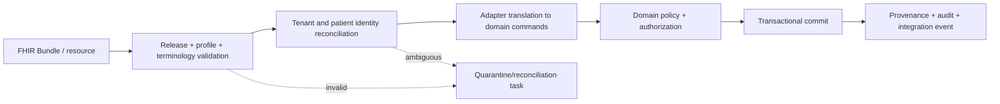

# Future FHIR adapter mapping

Ambrosia uses a domain-first relational model. FHIR is an import/export and interoperability contract—not the internal persistence model. A future adapter must select an explicit FHIR release, implementation guide, terminology package, and trading-partner capability statement before producing conformance claims.

Reference specifications: [HL7 FHIR](https://hl7.org/fhir/) and [US Core](https://www.hl7.org/fhir/us/core/). The exact profiles and versions remain a production-readiness decision.

## Mapping principles

- Translate through a versioned adapter package; API routers and domain entities do not emit database rows as FHIR-shaped JSON.
- Preserve source system, business identifier, resource logical ID/version, last-updated time, and raw payload checksum for reconciliation.
- Use standard terminologies when licensed/available: SNOMED CT for problems/findings, ICD-10-CM for diagnoses, CPT/HCPCS for services, LOINC for observations/reports, RxNorm for medications, UCUM for units, and standard body-site codes. A code is always stored with its system and display/version context.
- Reject or quarantine contradictory patient/tenant references. Never guess a patient match from name alone.
- Preserve provenance and security labels. Minimum-necessary exports omit internal prompts, presenter controls, and unrelated chart content.
- Keep lossy mappings explicit. Ambrosia’s lesion timeline, proposal/approval model, denial workflow, and demo clock have richer operational semantics than base FHIR resources.

## Resource crosswalk

| Ambrosia concept | Candidate FHIR resource(s) | Mapping notes / expected loss |
|---|---|---|
| `organizations` | `Organization` | Internal tenant identity remains authoritative; export business identifiers and endpoints selectively. |
| `locations` | `Location` | Map address, managing organization, status, timezone via profile/extension if required. |
| `users` | no direct clinical resource | Authentication subject is not automatically a FHIR practitioner or patient. |
| `memberships`, `roles` | `PractitionerRole` | Provider/staff organization/location/specialty role; application permissions are not exported as clinical roles. |
| `providers`, `staff_profiles` | `Practitioner`, `PractitionerRole` | Credentials/identifiers require verified systems; never export invented demo NPI as real. |
| `patient_accounts` | `Patient.link`, `RelatedPerson` where applicable | Portal authentication and invitation state stay internal. Proxy relationships may map to `RelatedPerson`. |
| `patients`, `patient_contacts` | `Patient`, related `RelatedPerson` | Map identifiers, demographics, telecom/address and contacts; matching policy is adapter-owned. |
| `coverages` | `Coverage` | Eligibility detail may also use payer-specific operations/resources. |
| `allergies` | `AllergyIntolerance` | Preserve clinical/verification status, category, criticality, reaction and recorder. |
| `medications` | `MedicationStatement` and/or `MedicationRequest` | Choose statement vs order by provenance; medication coding may reference `Medication`. |
| `problems` | `Condition` | Map clinical/verification status, category, onset, recorder and encounter. |
| `appointments` | `Appointment` | Readiness and intake details may require extensions or separate `Task`/`QuestionnaireResponse`. |
| `encounters` | `Encounter` | Keep appointment linkage, participants, service location and status. |
| `encounter_notes`, signed `note_versions` | `Composition` plus `DocumentReference`/`Binary` | A signed snapshot maps to a final composition/document. Internal draft versions need not be exported. |
| `note_amendments` | amended `Composition`/`DocumentReference.relatesTo` | Preserve amendment author/time/reason and relation; never replace the prior signed export silently. |
| `lesions` | `BodyStructure` | Persistent lesion identity can be represented as a body structure; implementation-guide support varies. |
| `lesion_observations` | `Observation` focused on `BodyStructure` | Dimensions/morphology/pigment/change may be components or separate coded observations; body site alone is insufficient for persistent identity. |
| `clinical_images`, `file_records` | `DocumentReference` and secured `Binary`; `Media` where selected release/profile supports it | Export metadata and an authorized retrieval route, not a public object URL. |
| `procedures` | `Procedure` | Link subject, encounter, performer, body site/lesion, reason, report and specimen. |
| `consents` | `Consent` | Map scope/category/policy/status/period; signed artifact may be a `DocumentReference`. |
| `orders` | `ServiceRequest` | Pathology/care orders reference patient, encounter, requester, specimen and reason. |
| `specimens` | `Specimen` | Map accession, type, collection, body site, container and parent where applicable. |
| `diagnostic_results` | `DiagnosticReport` plus `Observation` | Report links order, specimen, result observations, conclusion and presented form. Review/notification workflow remains internal tasks/events. |
| `conversations`, `messages` | `Communication` | Conversation threading, delivery receipts and draft lifecycle may require identifiers/extensions. Drafts are normally not exchanged. |
| `questionnaires`, `questionnaire_responses` | `Questionnaire`, `QuestionnaireResponse` | Normalized chart facts created from responses are also exported as their clinical resources. |
| communication preferences | `Patient.communication`, `Consent`, profile extensions | Channel opt-in/quiet hours often exceed base semantics and may stay internal. |
| `tasks` | `Task` | Map accountable follow-up work when exchange is required; internal queues/comments may be excluded. |
| workflow/automation records | `Task`, `Subscription`, `PlanDefinition` only where semantically valid | Do not expose engine internals merely to force a FHIR representation. |
| `eligibility_checks` | eligibility operation using `CoverageEligibilityRequest` / `CoverageEligibilityResponse` | Preserve request/response identifiers and payer source. |
| `estimates` | `Claim` preauthorization/predetermination patterns and `ExplanationOfBenefit` as agreed | Patient estimate presentation is trading-partner/profile specific. |
| `claims`, `claim_lines` | `Claim` | Diagnosis/procedure/service lines map with exact coding systems and submitted snapshot. |
| `claim_responses`, `claim_events` | `ClaimResponse`, `ExplanationOfBenefit` | Internal clearinghouse transport events remain provenance/integration history. |
| `denials`, `appeals` | `ClaimResponse`, `Task`, `Communication`, supporting `DocumentReference` | Appeal workflow has no single lossless base-resource mapping. |
| `payments` | `PaymentReconciliation`, `ExplanationOfBenefit` | Allocation and settlement semantics depend on remittance source. |
| `patient_balances` | `Account` | Internal ledger remains authoritative; export balance details only under an agreed profile. |
| `ai_runs`, `ai_inputs`, `ai_outputs` | `Provenance` and, where relevant, `DetectedIssue` | Model telemetry/prompts generally stay internal; derivation and agent identity accompany clinical output. |
| `proposed_actions`, `approvals` | `Task`/request resources plus `Provenance` | Only approved/executed clinical resources are authoritative. Proposal state must be clearly labeled if exchanged. |
| `provenance_records` | `Provenance` | Map agents, activities, entities, targets and recorded time. |
| `audit_events` | `AuditEvent` | Export is controlled; internal audit may contain security-sensitive metadata. |

## Signed-note export

For a signed note:

1. Load the exact immutable signed `note_version`, its signer, encounter, patient, author, amendments, and provenance.
2. Render a deterministic `Composition` with `status=final` (or the selected profile’s equivalent), stable identifier, attester, date and sections.
3. Represent later addenda as an amended document/version related to—not destructive replacement of—the original.
4. Attach `Provenance` identifying human author/signature and AI derivation where AI content contributed.
5. Record the outbound payload checksum, destination, consent/legal basis, and response in integration/audit events.

## Import pipeline

Inbound data never bypasses domain validation by inserting directly into clinical tables. Conditional create/update uses external identifier and source-version idempotency. Conflicts create a reconciliation task rather than silently overwriting a signed record.

## Adapter acceptance tests

- Round-trip stable identifiers and codes for each supported profile without cross-tenant leakage.
- Validate against the declared release/profile packages and representative payer/lab fixtures.
- Prove duplicate delivery idempotency and out-of-order version handling.
- Prove signed-note/amendment chronology and provenance survive export/import.
- Prove patient matching rejects ambiguous demographics and honors explicit merges/links.
- Prove access controls, consent/security labels, redaction, and audit events around every exchange.
- Publish a `CapabilityStatement`, supported search/operation matrix, terminology dependencies, and known lossy fields before enabling a live connection.
