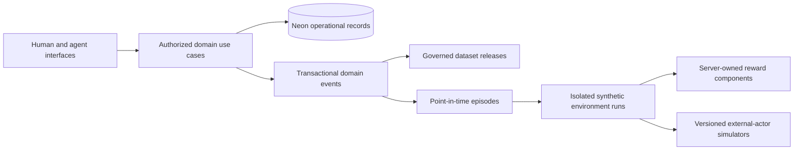

# Healthcare learning substrate and synthetic environment

Ambrosia separates the care system of record from the data products and simulation runs used
to evaluate or train models. The learning substrate does not authorize real patient data, model
training, autonomous clinical action, or cross-tenant pooling. Those remain production and
governance gates in `production-readiness.md`.

## System boundary



- The care plane owns authoritative clinical, operational, and financial state.
- The learning plane records immutable references, decisions, actions, outcomes, and dataset
  manifests. It is not an application log or an unrestricted copy of the chart.
- The simulation plane is synthetic, independently resettable, and cannot mutate the canonical
  demo scenario or any live care record.

The browser and agents use the same typed application commands and authorization rules. Neither
may write database rows, observations, evaluator evidence, outcomes, or rewards directly.

## Implemented first slice and expansion rule

The schema is cross-domain; capture is intentionally introduced at explicit use-case boundaries
rather than through ORM listeners. The first executable slice spans the canonical service journey:

| Operations surface | Initial authoritative capture |
|---|---|
| Patient access and intake | selected/offered scheduling state, normalized intake completion, consent/eligibility/estimate and triage result references |
| AI-assisted work | every run's prompt/input/output hashes, provider/model/fallback/schema/latency identity and logical resource references |
| Encounter completion | exact signed note version, consent, lesion, full proposal set, selected/rejected actions and procedure/order/specimen/message/task/claim results |
| Diagnostics and communication | pathology arrival, source-chain hashes, review task/draft, clinician review/notification/follow-up decision and closure outcomes |
| Revenue cycle | denial, claim/line, proposed correction, appeal/task evidence, biller edit/approval and resubmission outcome |
| Synthetic evaluation | isolated intake → encounter → result → notification → submission → denial recovery → closure state machine |

Additional workflows use the same rule: instrument the application command that already owns the
transaction, snapshot only already-authorized/loaded evidence, enumerate the complete choice set,
and link delayed outcomes when they become observable. Do not infer a decision from a row update,
treat a generated recommendation as viewed, or capture failed clinical state by committing it.

## Transactional event contract

A successful consequential mutation appends its domain event in the same transaction as the
domain records. Delivery cursors are mutable records separate from immutable events, so exporter
failure cannot change history. Each event carries:

- tenant, event type, schema version, aggregate identity, and aggregate sequence;
- actor kind, authorized role, source, request ID, correlation ID, and causation event;
- domain `occurred_at`, wall-clock `recorded_at`, and optional effective time;
- purpose of use, sensitivity, bounded metadata, and a canonical payload hash.

Payloads contain opaque resource references and bounded structured facts. They do not contain
unrestricted chart bodies, prompts, tokens, signed URLs, credentials, or raw provider payloads.
`AuditEvent` remains the security/access trail and `ProvenanceRecord` remains the derivation trail;
neither is repurposed as the trajectory ledger.

Failed application transactions remain rolled back in full. Privacy-safe failed-attempt telemetry
may be recorded outside the clinical transaction, but a failure record never justifies committing
partial care state.

## Episodes and point-in-time observations

An episode definition versions its start rules, termination rules, observation/action schemas,
reward schema, and limits. An episode instance identifies whether evidence is live, historical, or
synthetic. Events can be linked into episodes after ingestion without rewriting the source event.

An observation manifest records the information available at one decision cutoff. Resource entries
contain the resource type, opaque ID, immutable version where one exists, effective and recorded
times, content hash, and an optional governed snapshot reference. A current-state query is not a
valid historical observation.

A decision point records:

- the exact observation manifest;
- the authorized action set and policy versions in force;
- recommendations actually rendered, distinct from recommendations merely generated or served;
- the selected action or explicit non-action;
- actor/role, deadline, rationale code, and decision time.

Action attempts record expected target versions, idempotency, proposal version, human edit diffs,
execution status, and the resulting event. Outcomes record their observation window, source,
confidence, evaluator/simulator version, and one of `observed`, `simulated`, `expert`, or
`unsupported_counterfactual` provenance.

Historical replay stops at the first unsupported divergence. A recorded future is not reused after
an agent selects a materially different action. The branch must use a versioned simulator, expert
adjudication, an explicit rule boundary, or terminate as `unsupported_counterfactual`.

## Synthetic environment contract

The demo learning API is presenter-only and synthetic-only:

```text
GET  /api/demo/learning/episodes
GET  /api/demo/learning/console
GET  /api/demo/learning/episodes/{episode_id}/trajectory
POST /api/demo/learning/environment-runs
GET  /api/demo/learning/environment-runs/{run_id}
GET  /api/demo/learning/environment-runs/{run_id}/history
POST /api/demo/learning/environment-runs/{run_id}/steps
POST /api/demo/learning/environment-runs/{run_id}/model-step
GET  /api/demo/learning/dataset-manifests
```

Run creation derives the organization, requesting actor, active scenario, simulator versions, and
policies on the server. A step accepts only an expected sequence, idempotency key, and bounded typed
action. The server locks the run, validates the state-specific action set, creates the decision,
action, transition, next observation, and reward components, and advances the run in one
transaction. A retry with the same key and body returns the same receipt; reuse with different input
is rejected.

`model-step` asks the configured, schema-validated `environment_action` capability to choose from
the server-supplied action set. The action, prompt/model identity, fallback status, and resulting
reward components are committed together. Local development uses a visibly labeled deterministic
policy; managed environments may use the configured OpenAI model through the same validated
contract. The model still cannot author state, observations, rewards, or an action outside the
current allowlist. The server locks and validates the expected run sequence before inference, so a
stale or concurrent loser neither calls the provider nor creates an untraceable action. Each
completed step stores an immutable response receipt; even a retry after later steps returns the
original result.

Responses expose only synthetic observations, allowed actions, aggregate reward vectors, hard
violations, support status, and bounded run metadata. They never expose storage locators, raw
dataset manifests, evaluator evidence, or patient/entity membership lists.

## Internal learning console

`/internal/learning` is a separate presenter-gated application surface, not part of the clinician
workspace. It provides four bounded views over the contracts above:

- **Overview** shows aggregate episode, environment-run, AI-run, dataset, failure, and hard-safety
  counts plus recent synthetic activity.
- **Trajectories** reconstructs point-in-time observations, available and selected actions, events,
  and outcomes without resolving live chart resources.
- **Runs** creates an isolated seeded run, advances it one model-selected action at a time or to
  termination, and inspects observations, action provenance, vector rewards, and hard violations.
- **Datasets** shows release governance and item counts without storage locations or member lists.

Every browser request goes through the shared observable API client. Console reads are tenant-first,
page-capped, `private, no-store`, and presenter-only. Live content, raw prompts/outputs, resource
identifiers, storage references, dataset membership, and lineage locations are excluded; only
synthetic observation/state values may be rendered. Identifier-bearing live action targets become
safe categories plus tenant-scoped hashes. Trajectory pages are decision-owned, so their trigger/result
events and delayed outcomes travel with the decision; any bounded collection cap is explicit in both
the API and UI. The access-code form creates the same signed, HTTP-only demo session used by the API
and does not place the presenter secret in browser storage.

## Reward and safety contract

Rewards remain a vector through storage and evaluation. Initial components include safety, task
completion, timeliness, patient burden, staff burden, financial integrity, policy compliance, and
equity. A task may define versioned training weights later, but stored evidence is not collapsed into
one irreversible number.

Hard violations are non-tradeable and server-owned. Examples include unauthorized access,
fabricated evidence, missed required escalation, closing an unreviewed result, transmitting an
unapproved clinical message, altering signed documentation, or submitting unsupported codes.

## Dataset release and governance contract

Raw governed records, curated pseudonymous data, and released datasets are separate zones. A
dataset release records intended and prohibited uses, legal basis, cohort and exclusions, temporal
cutoffs, outcome windows, schema/terminology versions, de-identification method, split strategy,
lineage hash, retention/deletion policy, and approval. Release items identify included episodes or
events without embedding an ungoverned member list in JSON.

Dataset APIs expose manifest metadata only. Storage locations, re-identification mappings, raw
cohort SQL, and training members remain internal. A hash or pseudonym is not treated as HIPAA
de-identification, and no tenant's data is used across organizations without an approved legal and
contractual basis.

## Performance and operations

- Neon remains the hot operational and durable-workflow store; large training material is exported
  asynchronously to governed object storage rather than queried from request paths.
- The initial delivery mechanism is a transactional event table plus consumer checkpoints, which
  preserves scale-to-zero and avoids making a streaming cluster an operational prerequisite.
- Event and episode indexes lead with `organization_id` and the dominant time, aggregate, or status
  key. High-volume timestamps do not receive redundant global single-column indexes.
- Environment detail endpoints return only the latest step. Histories and datasets use bounded,
  paginated or offline export paths.
- Global request/database instrumentation, request correlation, structured route logs, private
  no-store headers, `Server-Timing`, query budgets, and PHI-safe logging apply automatically.
